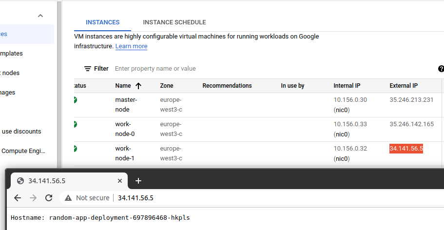

# Terraform-GCP-Ansible-Rancher

## Tested on Ubuntu 20.1

## Dependencies:
- Terraform
- Ansible
- Rke Rancher
- kubectl


## Task:
1. Создать через terraform 3 vps в digitalocean/aws/google cloud (где нравится)
2. Через ansible установить на них docker
3. Создать на нодах kubernetes кластер с помощью rke
4. Запустить в кластере deployment с обычным nginx’ом внутри.


## To check, follow these steps:

1. Create Service Account in GCP Role - editor
2. Create account key and save to ./terraform/service-account-key.json (it should never be checked into source control)
3. Install terraform on you local machine.  After install run: sudo mv terraform /bin/
4. Create ./terraform/terraform.tvars like ./terraform/example-tfvars
5. ```cd ./terraform && terraform init```
6. ```cd ./terraform && terraform apply```
7. Install ansible on you local machine ```sudo apt install ansible```
8. Run docker-playbook.yml in ansible dir: ```ansible-playbook docker-playbook.yml```
10. Install rke from https://rancher.com/docs/rke/latest/en/installation/ and (mv rke /bin/)
11. Install kubectl
12. Run  ```rke up``` in k8s dir
13. Check nodes: ```kubectl --kubeconfig kube_config_cluster.yml get nodes```
14. Run: ```kubectl --kubeconfig kube_config_cluster.yml apply -f ./deployments/nginx.yaml```
15. Check random worker-ip node
16. Destroy all nodes: ```terraform destroy``` in terraform dir

TODO: add init script with one command

## Example:
